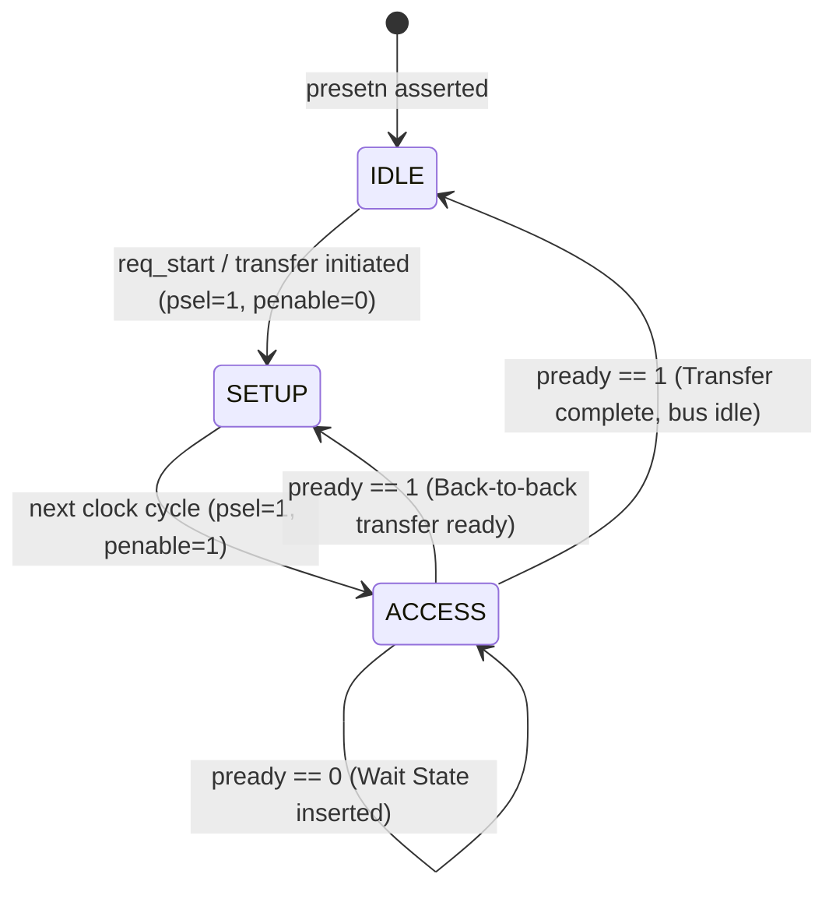

# APB4 Protocol Architecture Specification
**AMBA 4 Advanced Peripheral Bus (APB4) - Complete Hardware & Microarchitecture Reference**

---

## 1. Overview & Purpose in Modern AI Accelerators

In modern AI Systems-on-Chip (SoCs) and tensor processing units (e.g., Google TPU, Tenstorrent Wormhole/Blackhole, NVIDIA Blackwell SM CSRs, Cerebras Wafer-Scale Engine), data movement is divided into two distinct domains:
1. **Data Plane (High-Throughput)**: Ultra-wide (512-bit / 1024-bit) AXI4 or AXI-Stream buses moving gigabytes of weights and activations into Matrix Multiply Units (MMUs).
2. **Control Plane (Low-Power, Low-Latency)**: Unpipelined, lightweight register buses for programming **Control and Status Registers (CSRs)**.

**APB4** is the industry standard for the Control Plane.

### Where APB4 is Used in AI Hardware:
- **Matrix Dimension Configuration**: Setting $M, N, K$ tile sizes before launching systolic array operations.
- **Quantization & Scale Management**: Writing FP8, FP16, and INT8 dynamic scaling factors into activation engines.
- **Activation Function Selection**: Selecting hardware activation functions (ReLU, GELU, SiLU, Sigmoid) via control register bits.
- **DMA Descriptors & Triggering**: Arming on-chip DMA engines with source/destination addresses and burst lengths.
- **Hardware Fault & Telemetry Monitoring**: Reading back status registers to check for arithmetic exceptions (NaN/Infinity detected), FIFO overflows, thermal throttling, and completion interrupts.
- **ARM TrustZone Security Isolation**: Protecting cryptographic root keys, secure weight decryption engines, and privileged hypervisor registers.

---

## 2. Protocol Fundamentals & Transfer Phases

APB4 is a **synchronous, non-pipelined, 2-phase handshake bus**. Every transfer takes a minimum of two clock cycles (unless extended by wait states).



### Phase 1: IDLE
- `psel = 0`, `penable = 0`.
- The bus is unselected. Outputs remain static to eliminate unnecessary switching power.

### Phase 2: SETUP (Duration = Exactly 1 Cycle)
- Master drives `PADDR`, `PWRITE`, `PWDATA` (if write), `PSTRB` (byte enables), and `PPROT` (security/privilege levels).
- Master asserts `PSEL = 1`.
- `PENABLE` **must remain 0**.
- The slave uses this cycle to decode the address and security permissions.

### Phase 3: ACCESS (Duration $\ge$ 1 Cycle)
- Master asserts `PENABLE = 1` while keeping address, write data, and control signals **stable**.
- **Slave Handshake**: 
  - If the slave is ready to complete, it drives `PREADY = 1`.
  - If the slave requires internal processing time (e.g., crossing clock domains or accessing slow analog registers), it drives `PREADY = 0` to insert **wait states**.
- **Transfer Sampling**: Data transfer occurs on the rising clock edge where `PSEL = 1 \land PENABLE = 1 \land PREADY = 1`.

---

## 3. Detailed Signal Architecture

| Signal Name | Source | Width | Description |
|---|---|---|---|
| `pclk` | Clock Source | 1 | System clock (all transitions aligned to rising edge) |
| `presetn` | Reset Controller | 1 | Active-low asynchronous/synchronous reset |
| `paddr` | Master | `ADDR_WIDTH` | Byte address bus (default: 32 bits) |
| `pprot` | Master | 3 | Protection signals (`PPROT[0]` Privileged, `PPROT[1]` Secure/Non-Secure, `PPROT[2]` Data/Instruction) |
| `psel` | Interconnect/Master | 1 | Slave select line |
| `penable` | Master | 1 | Access phase strobe |
| `pwrite` | Master | 1 | `1` = Write transfer, `0` = Read transfer |
| `pwdata` | Master | `DATA_WIDTH` | Write data driven by master to slave (default: 32 bits) |
| `pstrb` | Master | `DATA_WIDTH/8` | Byte lane write strobes (`pstrb[i]` enables byte `pwdata[8*i +: 8]`) |
| `pready` | Slave | 1 | Ready handshake driven by slave |
| `prdata` | Slave | `DATA_WIDTH` | Read data driven by slave to master (default: 32 bits) |
| `pslverr` | Slave | 1 | Slave error flag (asserted during ACCESS when `pready=1`) |

---

## 4. Hardware Datapath & Register Map

### Register Policy Architecture:
The slave peripheral incorporates industry-standard hardware register types and security domains:

| Index | Offset | Type | Security Domain | Purpose |
| :---: | :---: | :---: | :---: | :--- |
| **0** | `0x00` | **RW** | Normal / Non-Secure | General system control register |
| **1** | `0x04` | **RW** | Normal / Non-Secure | Configuration & tile parameters |
| **2** | `0x08` | **RO** | Normal / Non-Secure | Live hardware status (Read-Only; writes trigger `PSLVERR`) |
| **3** | `0x0C` | **RW** | Normal / Non-Secure | Batch size / DMA length |
| **4** | `0x10` | **W1C** | Normal / Non-Secure | **Write-1-to-Clear** Interrupt status flags |
| **5** | `0x14` | **RW** | **Privileged Only** | Core configuration (Requires `PPROT[0] == 1`) |
| **6** | `0x18` | **RW** | **ARM TrustZone Secure** | Root encryption keys / CSR (Requires `PPROT[1] == 0`) |
| **7** | `0x1C` | **RW** | **Secure & Privileged** | Root-of-Trust configuration (Requires `PPROT[1:0] == 2'b01`) |

---

## 5. Security & Error Handling Mechanics

### 1. ARM TrustZone Protection (`PPROT[1]`)
- `PPROT[1] = 0` (Secure Access): Allowed to access all registers (including `REG6` and `REG7`).
- `PPROT[1] = 1` (Non-Secure Access): Blocked from reading or writing secure registers. The slave asserts `PSLVERR = 1` and preserves register contents.

### 2. Privileged Access (`PPROT[0]`)
- `PPROT[0] = 1` (Privileged Access): Allowed to access kernel/privileged CSRs (`REG5`, `REG7`).
- `PPROT[0] = 0` (User/Unprivileged Access): Blocked with `PSLVERR = 1`.

### 3. Write-1-to-Clear (W1C) Semantics
For interrupt status registers (`REG4`):
- Hardware sets flags dynamically (`reg_mem[4] <= reg_mem[4] | hw_status_set`).
- Software clears specific active flags by writing `1`s to those bit positions without disturbing adjacent active flags:
  $$\text{REG4} \leftarrow \text{REG4} \ \& \ \sim\text{PWDATA}$$

---

## 6. Verification & Test Suite

The testbench ([tb_apb_top.sv](file:///root/learning/Protocols/APB4/tb_apb_top.sv)) provides complete directed and security functional verification:

```bash
verilator --binary --timing APB4/tb_apb_top.sv APB4/apb_master.sv APB4/apb_slave.sv \
          --top-module tb_apb_top -o sim_apb_top && ./obj_dir/sim_apb_top
```

### Verified Test Cases:
1. **Reset State**: Verification of reset values.
2. **Full Word Read/Write**: Full 32-bit register readback.
3. **Byte Strobe Masking**: Partial byte writes using `PSTRB`.
4. **Read-Only Violation**: `PSLVERR` asserted when attempting to write `REG2`.
5. **Unaligned Address Exception**: `PSLVERR` asserted on unaligned address accesses.
6. **ARM TrustZone Security**: Non-Secure access to `REG6` correctly blocked with `PSLVERR`.
7. **Privilege Gating**: Unprivileged access to `REG5` correctly blocked with `PSLVERR`.
8. **W1C Interrupt Handling**: Verified hardware interrupt set and atomic software bit-clearing.
