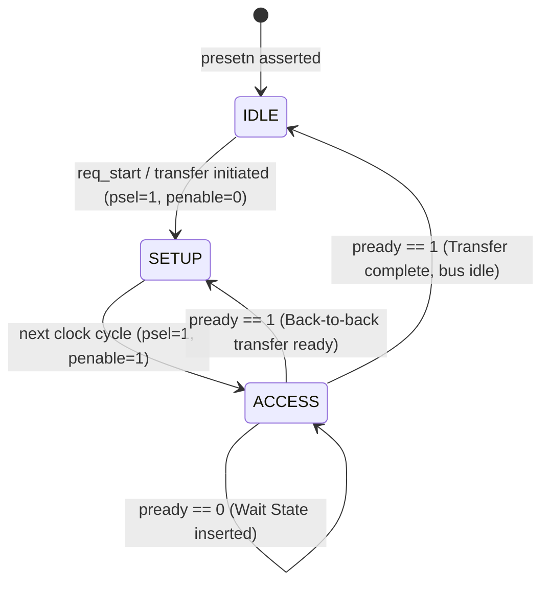

# APB4 Protocol Architecture Specification
**AMBA 4 Advanced Peripheral Bus (APB4) - Complete Hardware & Microarchitecture Reference**

---

## 1. Overview & Purpose in Modern AI Accelerators

In modern AI Systems-on-Chip (SoCs) and tensor processing units (e.g. Google TPU, Tenstorrent Wormhole/Blackhole, NVIDIA Blackwell SM CSRs, Cerebras Wafer-Scale Engine), data movement is divided into two distinct domains:
1. **Data Plane (High-Throughput)**: Ultra-wide (512-bit / 1024-bit) AXI4 or AXI-Stream buses moving gigabytes of weights and activations into Matrix Multiply Units (MMUs).
2. **Control Plane (Low-Power, Low-Latency)**: Unpipelined, lightweight register buses for programming **Control and Status Registers (CSRs)**.

**APB4** is the industry standard for the Control Plane. 

### Where APB4 is Used in AI Hardware:
- **Matrix Dimension Configuration**: Setting $M, N, K$ tile sizes before launching systolic array operations.
- **Quantization & Scale Management**: Writing FP8, FP16, and INT8 dynamic scaling factors into activation engines.
- **Activation Function Selection**: Selecting hardware activation functions (ReLU, GELU, SiLU, Sigmoid) via control register bits.
- **DMA Descriptors & Triggering**: Arming on-chip DMA engines with source/destination addresses and burst lengths.
- **Hardware Fault & Telemetry Monitoring**: Reading back status registers to check for arithmetic exceptions (NaN/Infinity detected), FIFO overflows, thermal throttling, and completion interrupts.

---

## 2. Protocol Fundamentals & Transfer Phases

APB4 is a **synchronous, non-pipelined, 2-phase handshake bus**. Every transfer takes a minimum of two clock cycles (unless extended by wait states).



### Phase 1: IDLE
- `psel = 0`, `penable = 0`.
- The bus is unselected. Outputs remain static to eliminate unnecessary switching power.

### Phase 2: SETUP (Duration = Exactly 1 Cycle)
- Master drives `PADDR`, `PWRITE`, `PWDATA` (if write), `PSTRB` (byte enables), and `PPROT`.
- Master asserts `PSEL = 1`.
- `PENABLE` **must remain 0**.
- The slave uses this cycle to decode the address.

### Phase 3: ACCESS (Duration $\ge$ 1 Cycle)
- Master asserts `PENABLE = 1` while keeping address, write data, and control signals **stable**.
- **Slave Handshake**: 
  - If the slave is ready to complete, it drives `PREADY = 1`.
  - If the slave requires internal processing time (e.g., crossing clock domains or accessing slow analog registers), it drives `PREADY = 0` to insert **wait states**.
- **Transfer Sampling**: Data transfer occurs on the rising clock edge where `PSEL = 1 \land PENABLE = 1 \land PREADY = 1`.

---

## 3. Detailed Signal Architecture

| Signal Name | Source | Width | Description |
|---|---|---|---|
| `pclk` | Clock Source | 1 | System clock (all transitions aligned to rising edge) |
| `presetn` | Reset Controller | 1 | Active-low asynchronous/synchronous reset |
| `paddr` | Master | 32 | Byte address bus |
| `psel` | Interconnect/Master | 1 | Slave select line |
| `penable` | Master | 1 | Access phase strobe |
| `pwrite` | Master | 1 | `1` = Write transfer, `0` = Read transfer |
| `pwdata` | Master | 32 | Write data driven by master to slave |
| `pstrb` | Master | 4 | Byte lane write strobes (`pstrb[i]` enables byte `pwdata[8*i +: 8]`) |
| `pready` | Slave | 1 | Ready handshake driven by slave |
| `prdata` | Slave | 32 | Read data driven by slave to master |
| `pslverr` | Slave | 1 | Slave error flag (asserted during ACCESS when `pready=1`) |

---

## 4. Hardware Datapath & State Machines

### Master FSM & Datapath:
The Master converts high-level CPU/Host software transactions into bus transitions:

```
                  +----------------------------------------------+
 CPU Request ---> | [Addr Reg]  [WData Reg]  [Strb Reg]          |
 (req_valid,      |                                              | ===> PADDR, PWDATA,
  req_write)      | [Master FSM: IDLE -> SETUP -> ACCESS]        |      PSEL, PENABLE, PWRITE
                  |                                              | <=== PREADY, PSLVERR, PRDATA
                  +----------------------------------------------+
```

### Slave Datapath & Register Slicing:
The Slave implements address decoding, byte strobe masking, and error validation:

```
                            +---------------------------------------+
   PADDR [31:0] ----------->| Address Decoder & Alignment Checker   | ---> addr_err
   PWRITE       ----------->| Read-Only Violation Checker           | ---> ro_err
                            +---------------------------------------+
                                                |
                               +----------------+----------------+
                               |                                 |
                               v (If Valid Write)                v (If Valid Read)
                   +-----------------------+         +-----------------------+
                   |  Byte-Strobe Masking  |         |  Read MUX             |
   PWDATA [31:0] ->|  (pstrb[3:0] enables) |         |  (4-to-1 MUX based on |
                   |  REG0, REG1, REG3     |         |   paddr[3:0])         |
                   +-----------------------+         +-----------------------+
                                                                 |
                                                                 v
                                                           PRDATA [31:0]
```

---

## 5. Architectural Choices & Hardware Design Decisions

1. **Why Check for Alignment (`paddr[1:0] != 2'b00`)?**
   - 32-bit registers require word-aligned addresses (`0x00`, `0x04`, `0x08`, `0x0C`). Allowing unaligned 32-bit access across byte `0x02` would require multi-register read/write splitters and barrel shifters, bloating silicon area and hurting timing closure.
   
2. **Why Byte Strobes (`pstrb[3:0]`) Instead of Byte-Level Addressing?**
   - Enables writing 8-bit or 16-bit fields inside a 32-bit register without performing a Read-Modify-Write cycle on the bus, preventing race conditions with hardware-updated bits.

3. **Why Assert `pslverr` on Read-Only Writes (`ro_err`)?**
   - Prevents software from corrupting internal hardware status sensors (such as systolic array `busy` or `overflow_err`). Blocks the write in silicon and alerts the CPU with a hardware bus error.

4. **Zero-Latch Combinational Strategy**:
   - Assigning `pready = 0`, `pslverr = 0`, and `prdata = 0` as unconditional defaults at the very beginning of the `always_comb` block guarantees that the synthesis tool will never infer an unwanted hardware transparent latch.

---

## 6. Verification & Waveform Guide

To simulate and verify all master/slave APB4 operations:
```bash
verilator --binary --timing -Wno-fatal APB4/tb_apb_top.sv APB4/apb_master.sv APB4/apb_slave.sv --top-module tb_apb_top -o sim_apb_top && ./obj_dir/sim_apb_top
```
