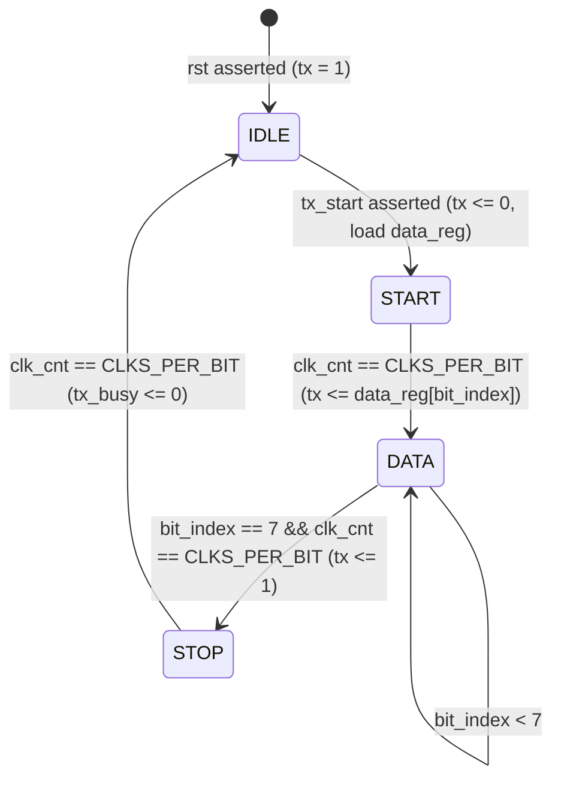
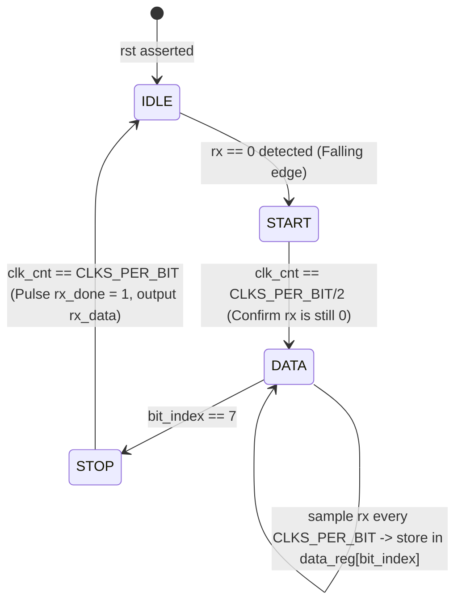

# UART Protocol Architecture Specification
**Universal Asynchronous Receiver/Transmitter - Serial Telemetry & Bring-Up Microarchitecture**

---

## 1. Overview & Purpose in Modern AI Accelerators

**UART (Universal Asynchronous Receiver/Transmitter)** is the universal serial communication interface in modern hardware engineering.

### Where UART is Used in AI Hardware:
- **Silicon Bring-Up & Debug Console**: The first interface connected during initial chip tapeout power-on to output bootloader messages and hardware self-test diagnostics.
- **Microcontroller Telemetry**: Streaming thermal temperatures, voltage rails, and power consumption telemetry from Power Management ICs (PMICs) to the host BMC.
- **Edge AI Sensor Ingestion**: Streaming low-bitrate sensor streams (audio tokens, IMU motion vectors) into TinyML neural processors.

---

## 2. Frame Architecture & Asynchronous Sampling

Because UART is **asynchronous** (there is no shared clock wire between TX and RX), both sides must agree on a predefined **Baud Rate** (e.g. 115,200 baud).

```
Idle (1) ---> [Start Bit: 0] ---> [8 Data Bits: D0..D7 (LSB First)] ---> [Stop Bit: 1] ---> Idle (1)
```

```
Bit Duration:  |<--- T_bit --->|
RX Line:       ____/‾‾‾‾‾‾‾‾‾‾‾\___________________/‾‾‾‾‾‾‾‾‾‾‾\___________
Sampling:               ^ (Sample at T_bit / 2 in the exact middle)
```

### Baud Rate Generation Formula:
$$\text{CLKS\_PER\_BIT} = \frac{\text{CLK\_FREQ}}{\text{BAUD\_RATE}}$$
For a 50 MHz clock and 115,200 baud:
$$\text{CLKS\_PER\_BIT} = \frac{50,000,000}{115,200} \approx 434 \text{ clock cycles per bit}$$

---

## 3. Hardware Datapath & State Machines

### Transmitter FSM (`uart_tx.sv`):


### Receiver FSM & Mid-Bit Sampling (`uart_rx.sv`):


---

## 4. Signal Architecture

| Signal Name | Module | Direction | Width | Description |
|---|---|---|---|---|
| `clk` | Global | In | 1 | System clock |
| `rst` | Global | In | 1 | Active-high reset |
| `tx_start` | TX | In | 1 | Trigger to start transmitting byte |
| `tx_data` | TX | In | 8 | 8-bit byte to transmit |
| `tx` | TX | Out | 1 | Serial output line (idle high) |
| `tx_busy` | TX | Out | 1 | High during transmission |
| `rx` | RX | In | 1 | Serial input line |
| `rx_data` | RX | Out | 8 | 8-bit received byte |
| `rx_done` | RX | Out | 1 | 1-cycle reception complete strobe |

---

## 5. Architectural Choices & Hardware Design Decisions

1. **Mid-Bit Sampling (`CLKS_PER_BIT / 2`)**:
   - In the `START` state, waiting half a bit period before sampling aligns the receiver clock to the exact middle of each incoming bit, providing maximum tolerance against baud rate drift, jitter, and rise-time slew.
2. **Idle-High Line State**:
   - Holding `tx = 1` and `rx = 1` during idle allows hardware to detect broken wires or disconnected cables immediately (which pull the line to constant logic `0`).
3. **FIFO Buffering**:
   - Integrating a hardware circular FIFO behind `rx_data` decouples byte reception from CPU polling intervals, preventing overrun errors under high CPU load.

---

## 6. Summary

The complete UART subsystem comprises:
- `uart_tx.sv`: Parallel-to-serial transmitter.
- `uart_rx.sv`: Serial-to-parallel mid-bit sampling receiver.
- `baud_rate_gen.sv`: Precise integer clock divider.
- `fifo.sv`: Circular FIFO queue for buffering characters.
- `uart_top.sv`: Top-level loopback/interconnect wrapper.
